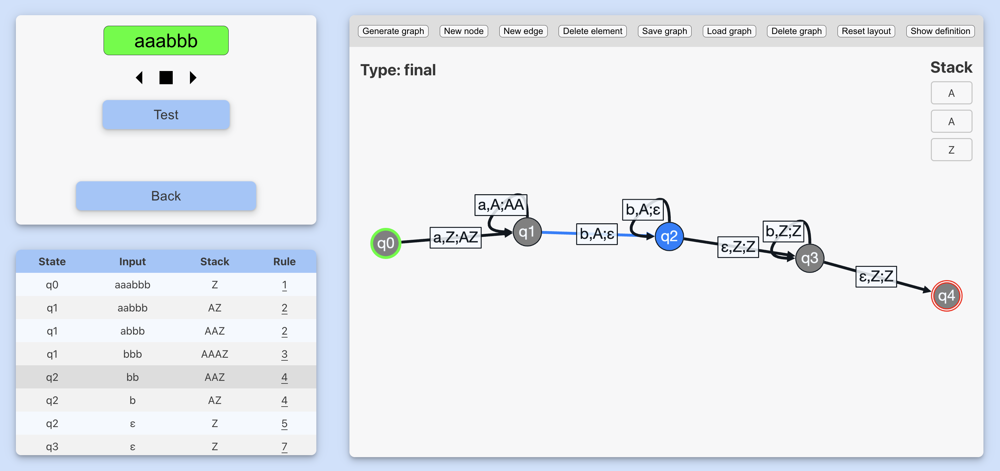
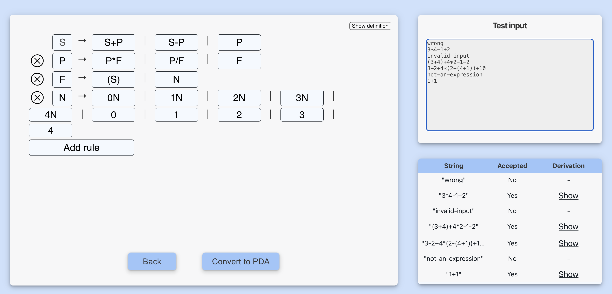

# Theoretical Informatics Tool
Authors: Jan Fojtík, Marek Krúpa

Interactive tool for learning automata theory.
It is divided into two parts: one section, authored by Jan Fojtík, 
focuses on pushdown automata and context-free grammars, while the other, created by a Marek Krúpa,
explores finite state automata and regular terms.
Built with TypeScript and Svelte, the tool aims to provide a comprehensive and engaging learning experience.


The tool is available at:
https://mannej.github.io/Theoretical-informatics-tool/

## Features
- Rendering of PDA using a graph
- Step-by-step simulation of PDA
- Conversion from CFG to PDA
- Generating words from CFG

## Interface




## Dependencies
- [Svelte](https://svelte.dev/)
- [TypeScript](https://www.typescriptlang.org/)
- [Cytoscape.js](https://js.cytoscape.org/)
- [Cytoscape.js-cola](https://github.com/cytoscape/cytoscape.js-cola)

## Installation and running
The project needs [Node.js](https://nodejs.org/en/) to be installed.
To install the project, run:
```bash
npm install
npm run build
cd dist
npm run preview
```
